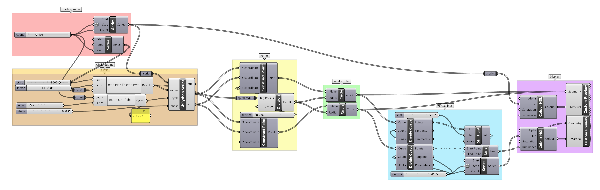
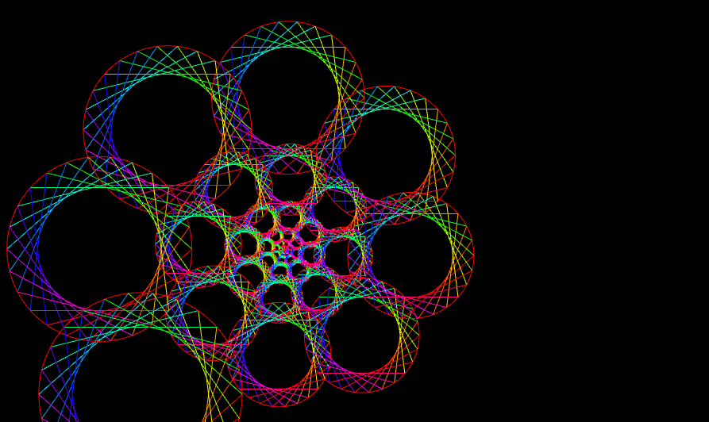
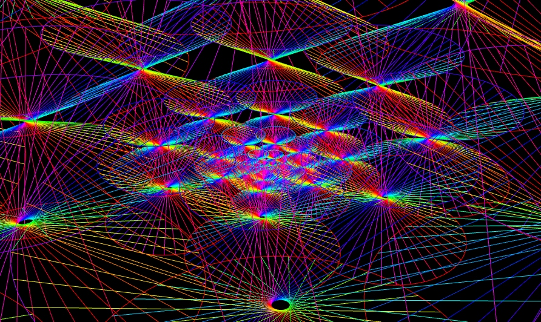
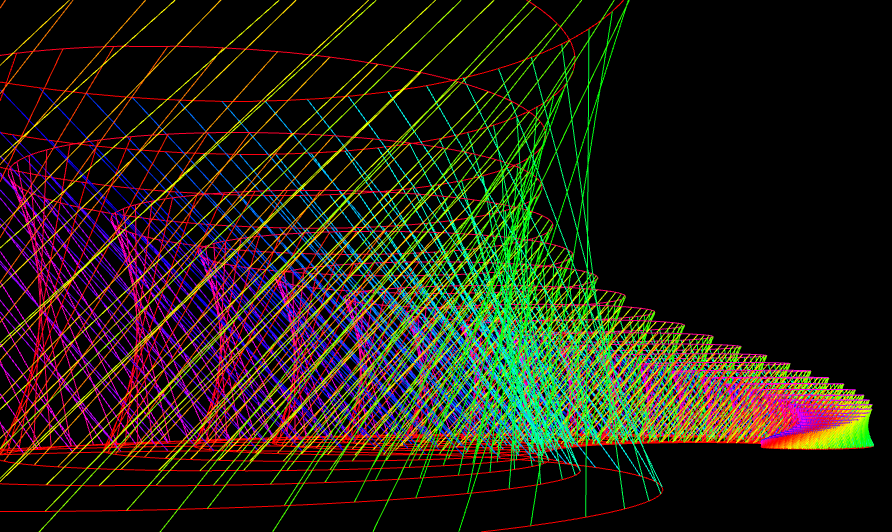
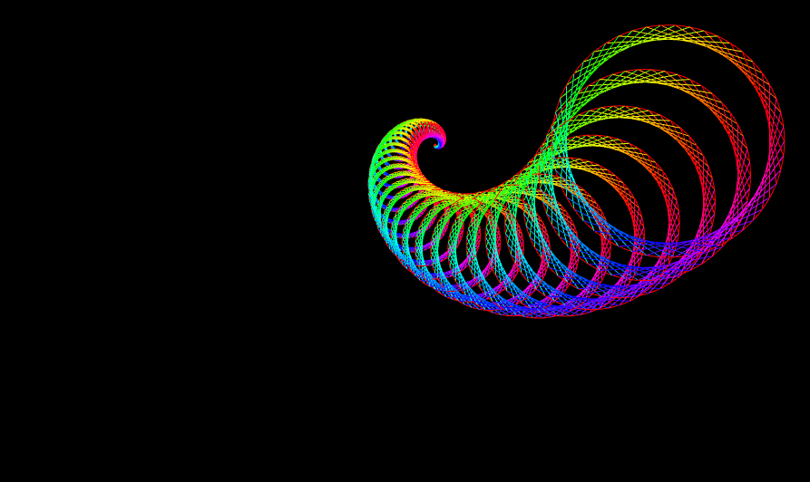
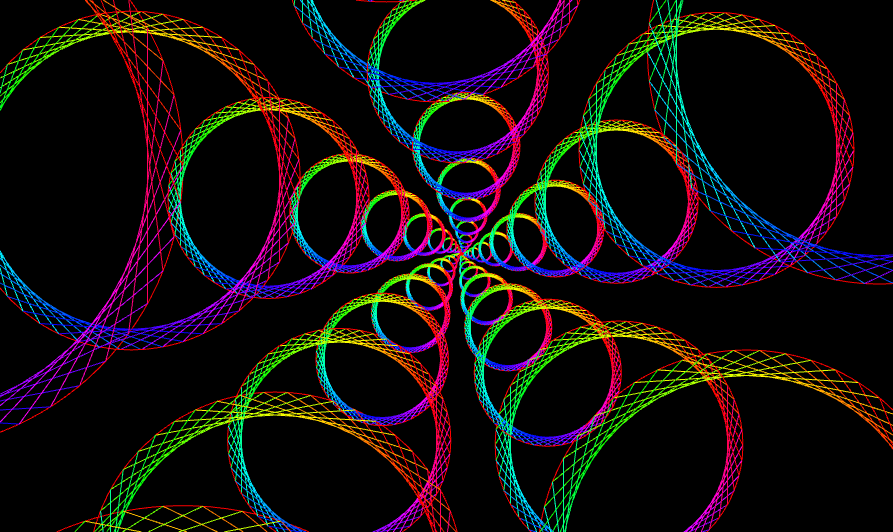
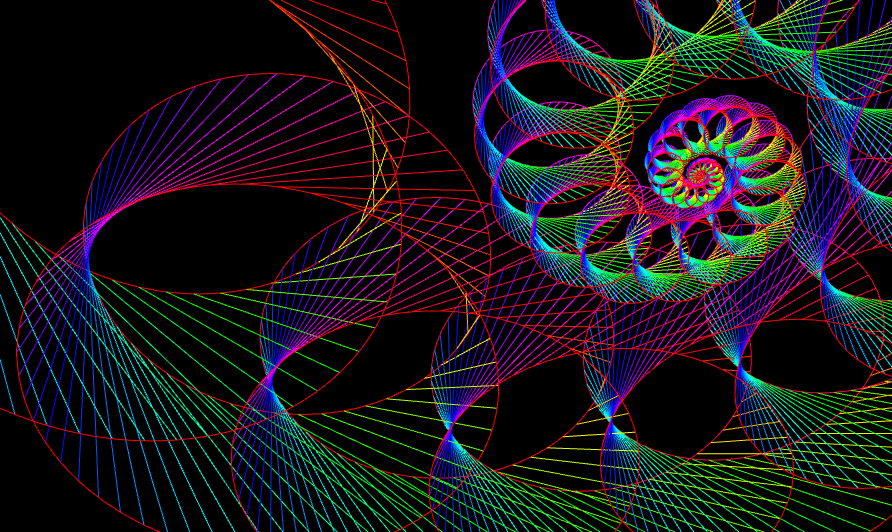
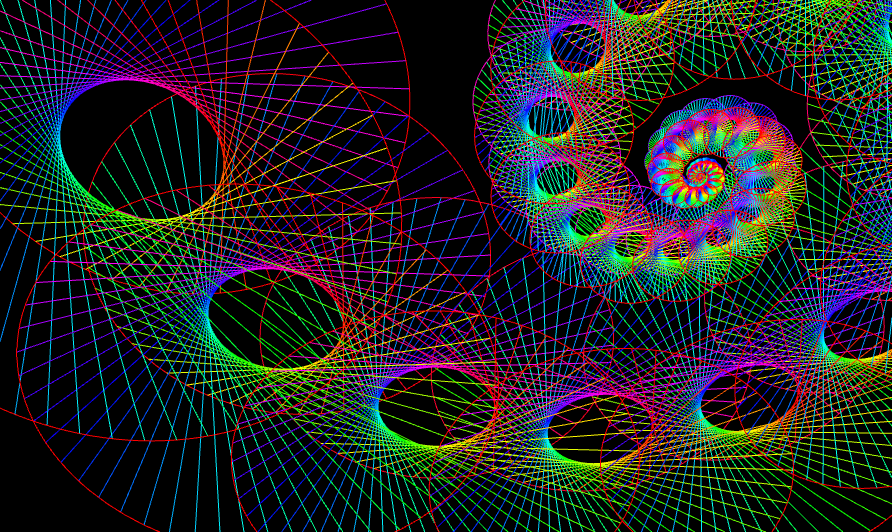
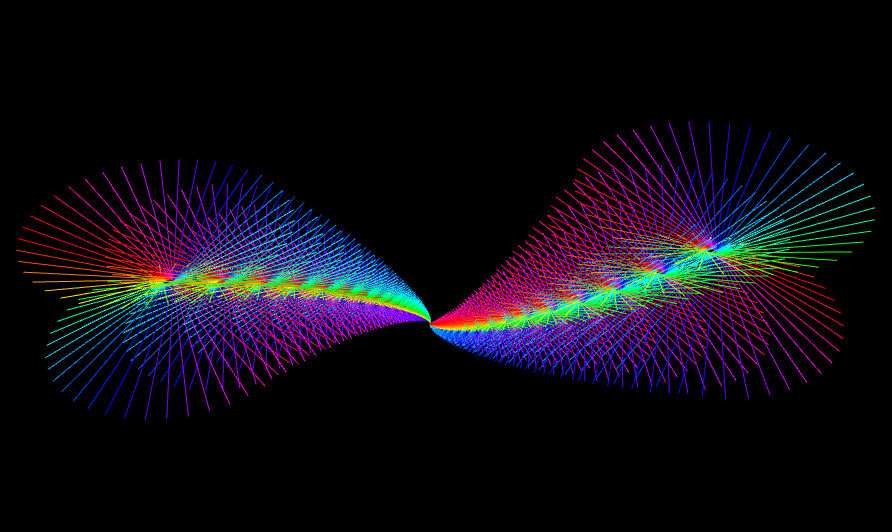

# Psychedelic Phyllotaxis
Psychedelic Phyllotaxis is an artwork made with arithmetic formulas in Grasshopper.

## Description

Inspired by phyllotaxis, the arrangement of leaves on plant stems. The vibrant choice of colours give rise to a psychedelic disposition for an otherwise usual pattern seen in nature.

The structure comprises of an outward spiral of conic sections with increasing radius proportional to the radius of the outward spiral. The appearance of the spiral and the conic sections can be altered with input variables to create diversified patterns.

The height of the conic sections are proportional to the radius of the outward spiral, akin to a circular grandstand.

Finally, the colours of the lines within the conic sections are determined by a normal distribution from 0 to 1.

## Methodology

The above figure shows the grasshopper programme used to create the design variations shown in this documentation and in [this folder](pics). 

To run the grasshopper program, use a suitable viewer, such as Rhino.

### Variables
The following variabes can be modified using the number slides in the Grasshopper program, to create variations of the design.
1. Sides of spiral -- determines how many conic sections are in one period. In otherwards, the rate at which the spiral expands outwards. This is illustrated by the gif above.
2. Spiral Radius Divider -- determines the radius of the spiral.
3. Conic Shift -- determines the shift in the list of points between the two circles forming the conic section. This is illustrated between the first 2 figures under [Design outcomes](#design-outcomes)
4. Conic Density -- determines the density of the lines forming the conic section.

## Design outcomes

  
  
  
  
  
  
  

## Design thinking process
Using the phyllotactic spirals seen in nature as a source of inspiration, I created a circular spiral with an exponentially increasing radius with respect to the normalized time series.

Afterwards, in order to alter the number of points per cycle, I inserted the parameter ‘sides’ using a number slider. This enabled the roundness of the spiral to be easily modified.

At this point, the design seemed rather empty. To populate the canvas, I added 3D cones to each of the points on the spiral. However, the cones were of a singular shade and did not allow for variation of colours. This made the design clunky and undesirable. 

Instead, I decided to implement a conic section on every point of the spiral. By generating 2 circles with the same x and y coordinates but different z coordinates, I divided the circles into multiple points and connected the points on one circle to the other. By shifting the list of point for one of the cycles, I noticed that the shape created by the lines between the 2 circles was transformed from a cylinder to a conic section. The degree to which the cylinder was transformed into a conic section could be manipulated by the size of the index shifted.

An interesting observation was that to make a perfect conic section, the number of points on each circle must be exactly twice the index of points that the second circle was shifted by.

Finally, to add depth to the 3rd dimension, instead of having a constant height for every conic section, the height of the conic section is made to be proportional to the radius of the outward spiral.

Due to the different parameters modifiable, the main design can be tweaked in several ways as shown in [Design outcomes](#design-outcomes). By viewing it from different angles, a greater appreciation of the design can be derived.
 

